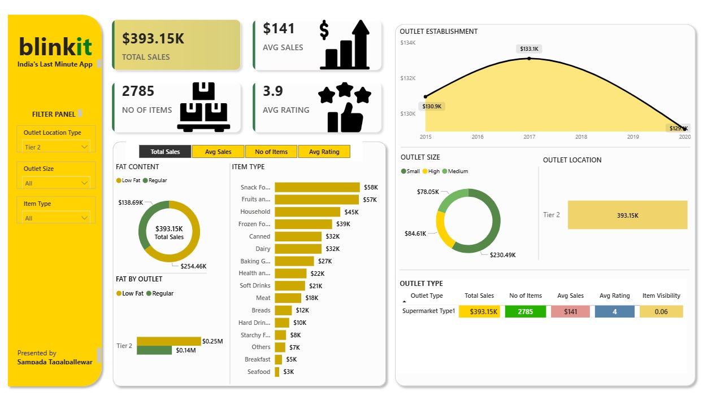

# 🛒 Blinkit Power BI Dashboard

A Power BI analytics dashboard built to track and visualize **business performance metrics** for Blinkit (Instant Grocery Delivery), providing interactive insights into sales trends, revenue, ratings, geographical performance, and category-level demand.

---

## 📊 Dashboard Features

- ✅ **Tracks total sales, revenue, and customer ratings**
- 🌍 **Shows top-performing cities and product categories**
- 🔍 **Interactive filtering by region & customer segment**
- 📈 **Data-driven insights for smarter decision-making**
- ⚡ Real-time visual analytics powered by **Power BI**

---

## 🧩 Filters Included

- Region / City
- Product Category
- Customer Segment
- Sales Performance Metrics

---

## 🚀 How to Use

1. Download the `.pbix` file from this repository.
2. Open it using **Power BI Desktop**.
3. Interact with the visuals to explore insights.
4. Apply filters to analyze region-wise or segment-wise trends.

---

## 📸 Dashboard Screenshot

## 🛠️ Tools Used

- Power BI Desktop

